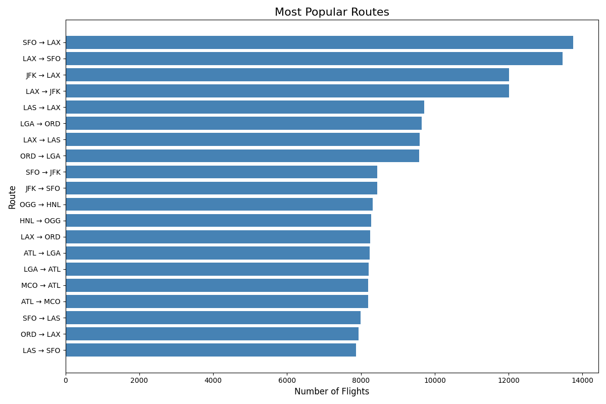

This is a quick Python Dask and Pandas project. It was on a flight dataset of over a million EasyJet flights I had gotten as part of a college workshop.

The dataset had some intentional errors, so some of the programs have some data cleaning. The first programs are to generate some artificial crew data. Then creates a fake crew assignment for a few months worth of flights. This needs to obey some fatigue management rules for the aviation industry.

The latter programs are a more general data analysis. To find popular routes, track airplane wear by tail number etc.

This is a quick Python Dask and Pandas project. It was on a flight dataset of over a million EasyJet flights I had gotten as part of a college workshop.

The dataset had some intentional errors, so some of the programs have some data cleaning. The first programs are to generate some artificial crew data. Then creates a fake crew assignment for a few months worth of flights. This needs to obey some fatigue management rules for the aviation industry.

The latter programs are a more general data analysis. To find popular routes, track airplane wear by tail number etc.

