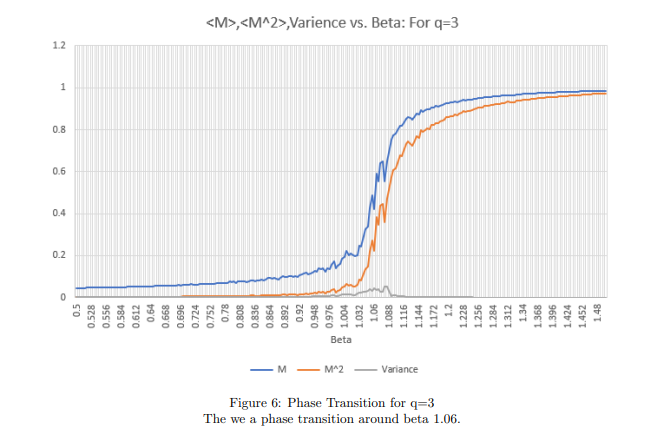

A simulation from college I really enjoyed. Potts model was an extension of the Ising model, allowing for each lattice site to be in any 'n' number of states, leading to some complex dynamics as this number increases.
I have used this simulation as a skeleton for the Coral Bleaching and Olive grove SIR projects .

  

