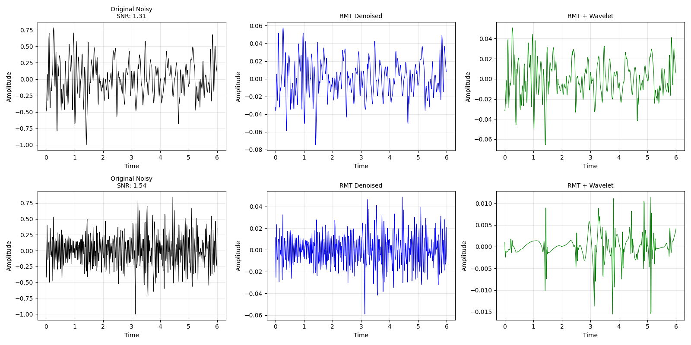

Project for practicing denoising techniques. 
I don't think the results where great, but gave me good practice with eigenvalue filtering and wavelets.
Code is a simple combination of random matrix theory and wavelet transforms to denoise. 
The data was smaller earthquake waveform samples taken in Pasedena California, a station which gets alot of urban noise interference during it's earthquake recordings.

